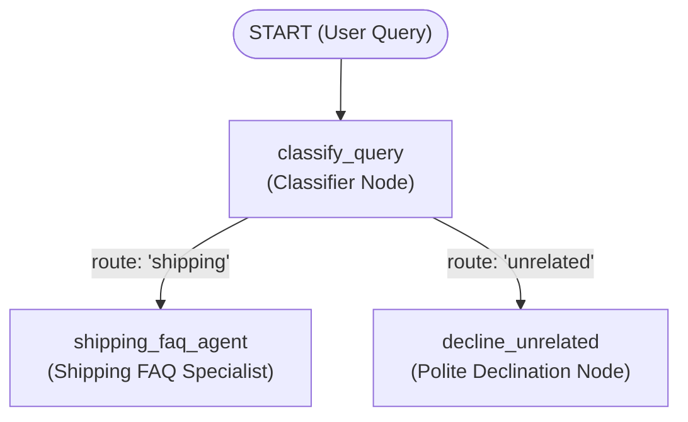

# Customer Support Graph Workflow Agent

A graph workflow agent built with **Google ADK 2.0 (Agent Development Kit)** acting as a customer support representative for a shipping company (**SwiftShip Logistics**).

---

## 🏗️ Architecture & Graph Topology

The workflow uses ADK 2.0's graph-based `Workflow` engine to classify incoming customer queries and route them based on subject matter:



### Nodes Overview

1. **`classify_query` (Classification Node)**:
   - Evaluates whether the customer's query is related to shipping services (**rates/pricing**, **package tracking**, **delivery scheduling**, or **returns/exchanges**).
   - Uses structured Gemini classification with a heuristic fallback for high resilience.
   - Emits an `Event` with route set to either `'shipping'` or `'unrelated'`.

2. **`shipping_faq_agent` (LLM Agent Node)**:
   - Specialized customer support agent for SwiftShip Logistics.
   - Answers questions on shipping rates, transit times (Ground, Express, Overnight), tracking status, delivery instructions, and return labels.

3. **`decline_unrelated` (Polite Declination Node)**:
   - Handles unrelated queries (e.g. general trivia, coding questions, recipes).
   - Courteously explains that the agent specializes exclusively in shipping-related inquiries and guides the customer on what questions it can answer.

---

## 📁 Project Structure

```
customer-support-agent/
├── app/
│   ├── __init__.py            # Exports the App instance
│   ├── agent.py               # Graph workflow definition, nodes, and routing
│   ├── fast_api_app.py        # FastAPI server with A2A protocol integration
│   └── app_utils/             # Session, artifact, and telemetry utilities
├── tests/
│   ├── unit/
│   │   ├── test_workflow.py   # Unit tests for graph topology and routing
│   │   └── test_dummy.py
│   └── integration/
│       ├── test_agent.py      # Agent streaming integration test
│       └── test_server_e2e.py # Server SSE and A2A integration tests
├── GEMINI.md                  # Development guide and context
├── pyproject.toml             # Project dependencies (ADK >= 2.7.0)
└── agents-cli-manifest.yaml   # Project manifest
```

---

## 🚀 Quick Start

### 1. Prerequisites

- Python `>= 3.11`
- `uv` installed (`pip install uv` or `brew install uv`)
- A valid Gemini API key configured in `.env`:
  ```bash
  GEMINI_API_KEY="your-api-key"
  GOOGLE_GENAI_USE_ENTERPRISE="FALSE"
  ```

### 2. Install Dependencies

```bash
uv sync
```

### 3. Run Tests

```bash
uv run pytest -v
```

### 4. Run Interactive Local Server / Playground

```bash
uv run agents-cli playground
```
or run the FastAPI server:
```bash
uv run python -m app.fast_api_app
```
